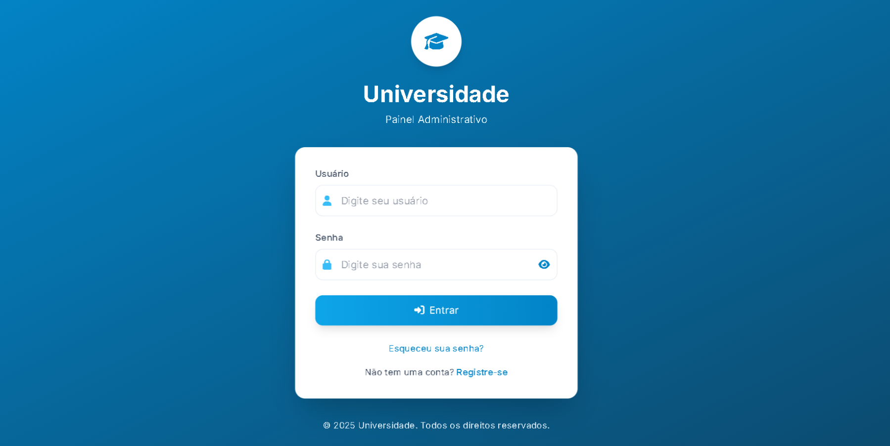
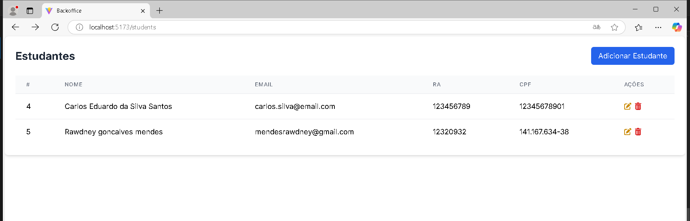

# Aplicação de Gerenciamento de Alunos

Uma aplicação para gerenciamento de matrículas de alunos na turma de Programação Web da instituição Edtech.

## Estrutura do Projeto

### Arquitetura do Backend
```
backend/
└── src/
    ├── config/         # Arquivos de configuração
    ├── controllers/    # Controladores de rotas da API
    ├── dto/            # Objetos de Transferênci de Dados

    ├── entities/       # Entidades do banco de dados
    ├── middlewares/    # Middlewares do Express
    ├── migrations/     # Scripts de migração
    ├── repositories/   # Repositórios de acesso a dados
    ├── routes/         # Definições de rotas
    ├── services/       # Serviços de lógica de negócio
    ├── types/          # Definições de tipos
    ├── utils/          # Funções utilitárias
    ├── app.ts          # Configuração do aplicativo Express
    ├── inversify.config.ts  # Configuração de injeção de dependência
    └── server.ts       # Ponto de entrada da aplicação
```

### Arquitetura Backend
- **Arquitetura Modular**: Organizada em módulos baseados em funcionalidades para melhor escalabilidade e manutenção
- **Injeção de Dependência**: Utilizada para baixo acoplamento e melhor testabilidade através do `inversify`
- **Padrão Repository**: Implementado para abstração de acesso a dados
- **Camada de Serviço**: Separação da lógica de negócios
- **Middleware**: Autenticação e validação de requisições
- **Decorators**: Utilizados para definição de rotas, validação de parâmetros e documentação de métodos

### Autenticação
- Autenticação baseada em JWT
- Persistência de token no LocalStorage
- Implementação de refresh token
- Rotas protegidas

### Testes
- Testes unitários mockados para controllers e serviços
- Cobertura de testes para:
  - AuthController
  - StudentController
  - StudentRepository
  - StudentService

### Documentação da API
- Documentação Swagger disponível
- Todos os endpoints documentados incluindo o endpoint de edição de estudantes

## Configuração do Ambiente
Crie um arquivo `.env` com as seguintes variáveis:
```
DB_TYPE=postgres
DB_HOST=localhost
DB_PORT=5432
DB_USERNAME=usuario
DB_PASSWORD=senha
DB_NAME=nome_banco
DB_LOGGING=true
DB_SSL=false
```

## Instalação do Backend
1. Instalar dependências
```bash
cd backend

npm install ou yarn 
```

2. Executar migrações
```bash
npm run migration:run
```

3. Iniciar servidor e startar a aplicação backend
```bash
npm run build

npm run start
```

## Funcionalidades Pendentes
- Interface de edição de alunos (endpoint da API disponível no Swagger)
- Colocar a aplicação no docker juntamente com um banco de dados(pendencia backend e front-end)

## Instalação do Frontend
1. Navegar para o diretório frontend
```bash
cd frontend
```

2. Instalar dependências
```bash
npm install
```

3. Configurar variáveis de ambiente
- Criar arquivo `.env` com configurações necessárias
- Configurar URL da API backend

4. Iniciar servidor de desenvolvimento
```bash
npm run dev
```

5. Construir para produção
```bash
npm run build
```

## Dependências Frontend
- Vue.js 3
- Vue Router
- Axios
- Bootstrap
- TypeScript
- Vite

## Scripts Disponíveis
- `npm run dev`: Iniciar servidor de desenvolvimento
- `npm run build`: Compilar para produção
- `npm run preview`: Visualizar build de produção

## Destaques Técnicos
- Decorators TypeScript para definição de rotas
- Middleware para validação de requisições e autenticação
- Injeção de dependência para melhor testabilidade e manutenção
- Autenticação JWT com mecanismo de refresh token
- Padrão repository para acesso a dados
- Camada de serviço para lógica de negócios
- Arquitetura modular para melhor organização do código


## Screenshots do Projeto

### Tela de Login


### Lista de Alunos


### Cadastro de Alunos

